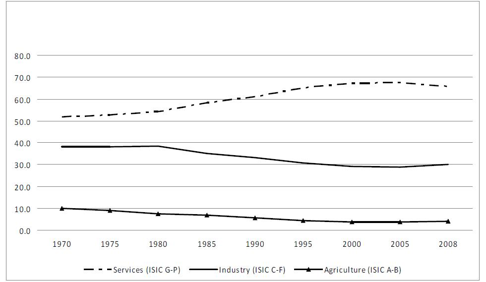
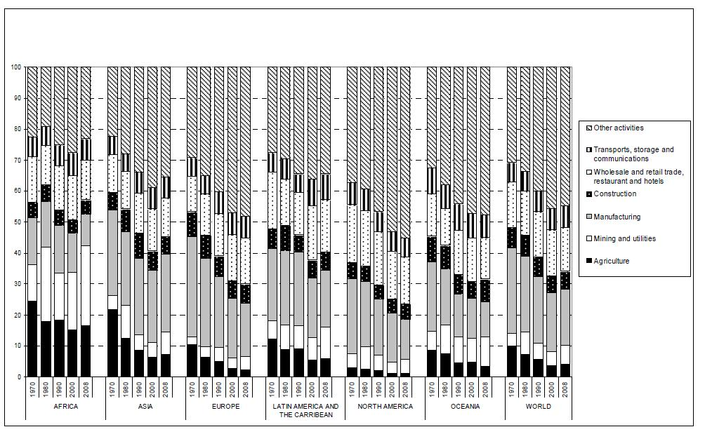
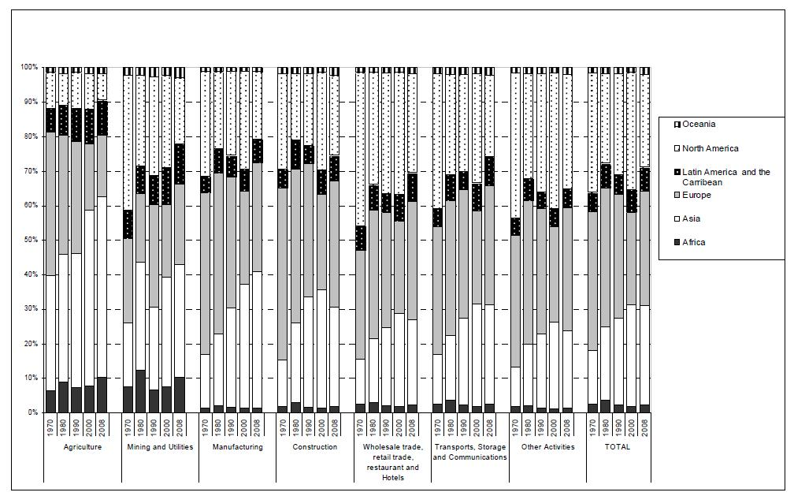
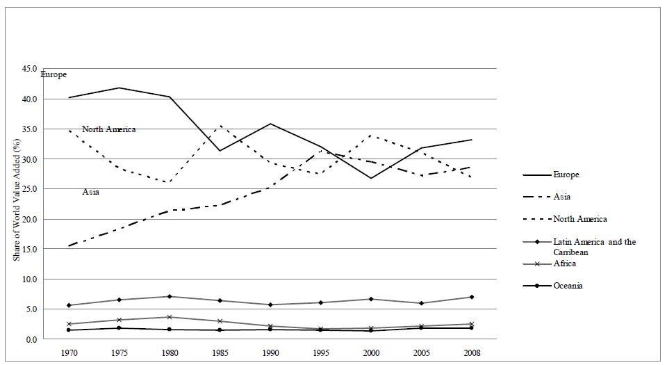
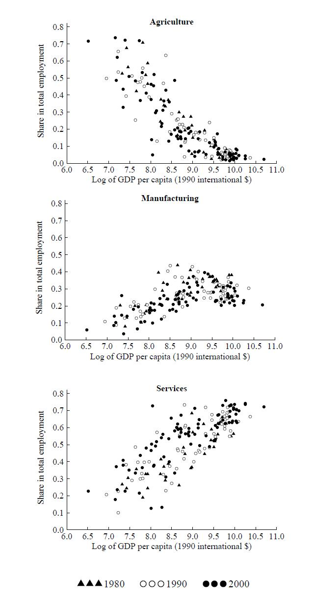
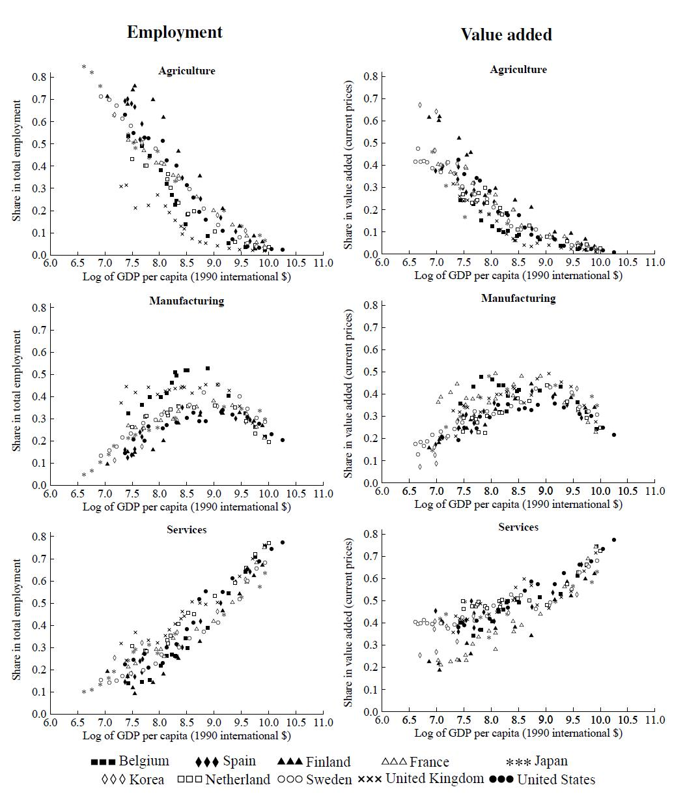
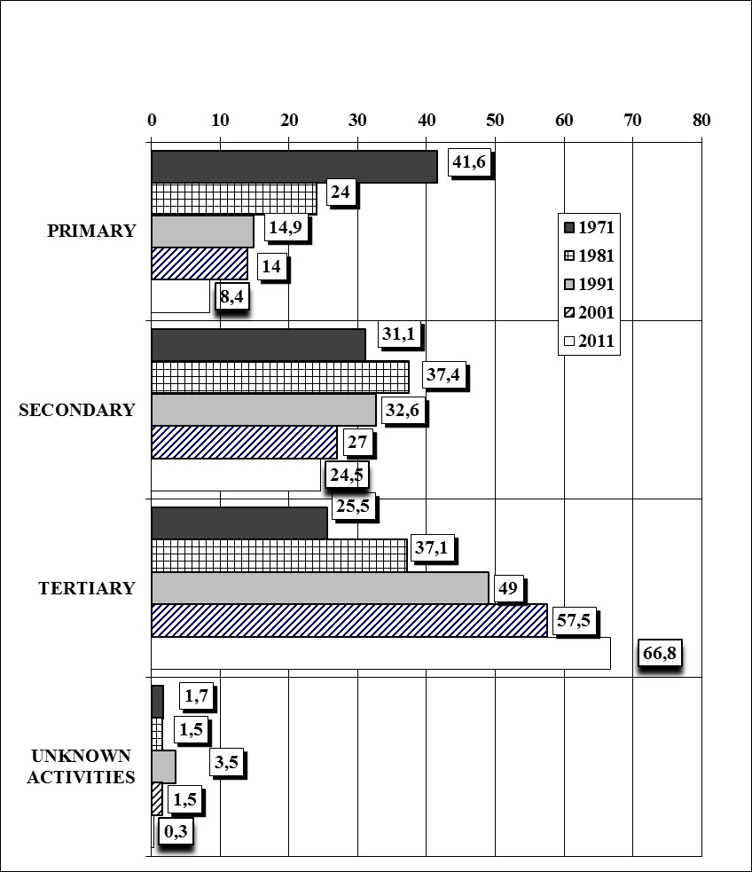
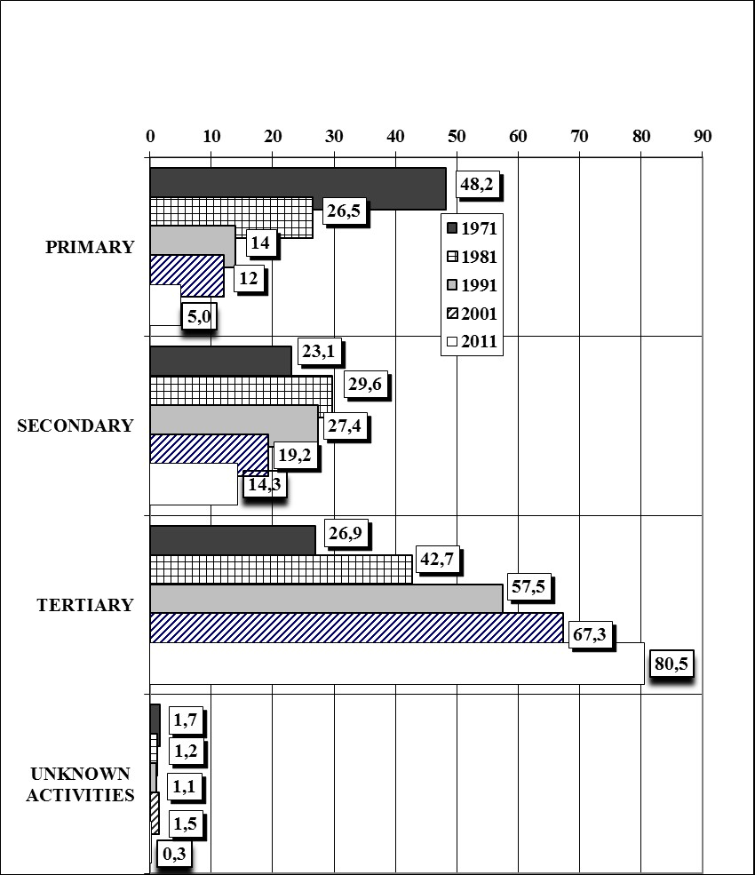
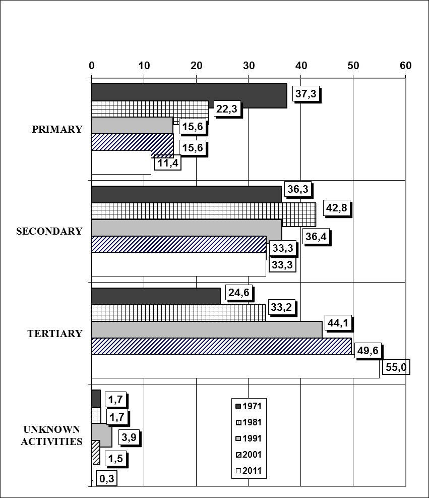
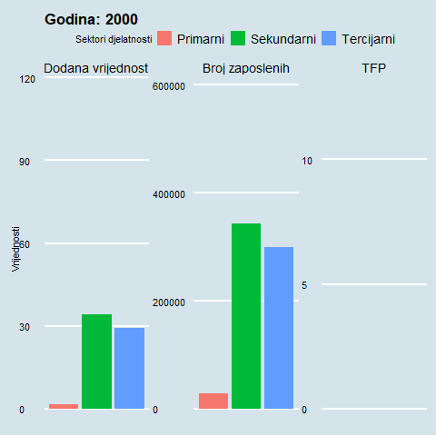

class: inverse, middle

```{R, setup, include = F}
# devtools::install_github("dill/emoGG")
library(pacman)
p_load(
  broom, tidyverse,
  latex2exp, ggplot2, ggthemes, ggforce, viridis, extrafont, gridExtra,
  kableExtra, snakecase, janitor,
  data.table, dplyr, estimatr,
  lubridate, knitr, parallel,
  lfe,
  here, magrittr
)
# Define pink color
red_pink <- "#e64173"
turquoise <- "#20B2AA"
orange <- "#FFA500"
red <- "#fb6107"
blue <- "#2b59c3"
green <- "#8bb174"
grey_light <- "grey70"
grey_mid <- "grey50"
grey_dark <- "grey20"
purple <- "#6A5ACD"
slate <- "#314f4f"
# Dark slate grey: #314f4f
# Knitr options
opts_chunk$set(
  comment = "#>",
  fig.align = "center",
  fig.height = 7,
  fig.width = 10.5,
  warning = F,
  message = F
)
opts_chunk$set(dev = "svg")
options(device = function(file, width, height) {
  svg(tempfile(), width = width, height = height)
})
options(crayon.enabled = F)
options(knitr.table.format = "html")
# A blank theme for ggplot
theme_empty <- theme_bw() + theme(
  line = element_blank(),
  rect = element_blank(),
  strip.text = element_blank(),
  axis.text = element_blank(),
  plot.title = element_blank(),
  axis.title = element_blank(),
  plot.margin = structure(c(0, 0, -0.5, -1), unit = "lines", valid.unit = 3L, class = "unit"),
  legend.position = "none"
)
theme_simple <- theme_bw() + theme(
  line = element_blank(),
  panel.grid = element_blank(),
  rect = element_blank(),
  strip.text = element_blank(),
  axis.text.x = element_text(size = 18, family = "STIXGeneral"),
  axis.text.y = element_blank(),
  axis.ticks = element_blank(),
  plot.title = element_blank(),
  axis.title = element_blank(),
  # plot.margin = structure(c(0, 0, -1, -1), unit = "lines", valid.unit = 3L, class = "unit"),
  legend.position = "none"
)
theme_axes_math <- theme_void() + theme(
  text = element_text(family = "MathJax_Math"),
  axis.title = element_text(size = 22),
  axis.title.x = element_text(hjust = .95, margin = margin(0.15, 0, 0, 0, unit = "lines")),
  axis.title.y = element_text(vjust = .95, margin = margin(0, 0.15, 0, 0, unit = "lines")),
  axis.line = element_line(
    color = "grey70",
    size = 0.25,
    arrow = arrow(angle = 30, length = unit(0.15, "inches")
  )),
  plot.margin = structure(c(1, 0, 1, 0), unit = "lines", valid.unit = 3L, class = "unit"),
  legend.position = "none"
)
theme_axes_serif <- theme_void() + theme(
  text = element_text(family = "MathJax_Main"),
  axis.title = element_text(size = 22),
  axis.title.x = element_text(hjust = .95, margin = margin(0.15, 0, 0, 0, unit = "lines")),
  axis.title.y = element_text(vjust = .95, margin = margin(0, 0.15, 0, 0, unit = "lines")),
  axis.line = element_line(
    color = "grey70",
    size = 0.25,
    arrow = arrow(angle = 30, length = unit(0.15, "inches")
  )),
  plot.margin = structure(c(1, 0, 1, 0), unit = "lines", valid.unit = 3L, class = "unit"),
  legend.position = "none"
)
theme_axes <- theme_void() + theme(
  text = element_text(family = "Fira Sans Book"),
  axis.title = element_text(size = 18),
  axis.title.x = element_text(hjust = .95, margin = margin(0.15, 0, 0, 0, unit = "lines")),
  axis.title.y = element_text(vjust = .95, margin = margin(0, 0.15, 0, 0, unit = "lines")),
  axis.line = element_line(
    color = grey_light,
    size = 0.25,
    arrow = arrow(angle = 30, length = unit(0.15, "inches")
  )),
  plot.margin = structure(c(1, 0, 1, 0), unit = "lines", valid.unit = 3L, class = "unit"),
  legend.position = "none"
)
theme_set(theme_gray(base_size = 20))
# Column names for regression results
reg_columns <- c("Term", "Est.", "S.E.", "t stat.", "p-Value")
# Function for formatting p values
format_pvi <- function(pv) {
  return(ifelse(
    pv < 0.0001,
    "<0.0001",
    round(pv, 4) %>% format(scientific = F)
  ))
}
format_pv <- function(pvs) lapply(X = pvs, FUN = format_pvi) %>% unlist()
# Tidy regression results table
tidy_table <- function(x, terms, highlight_row = 1, highlight_color = "black", highlight_bold = T, digits = c(NA, 3, 3, 2, 5), title = NULL) {
  x %>%
    tidy() %>%
    select(1:5) %>%
    mutate(
      term = terms,
      p.value = p.value %>% format_pv()
    ) %>%
    kable(
      col.names = reg_columns,
      escape = F,
      digits = digits,
      caption = title
    ) %>%
    kable_styling(font_size = 20) %>%
    row_spec(1:nrow(tidy(x)), background = "white") %>%
    row_spec(highlight_row, bold = highlight_bold, color = highlight_color)
}
```

```{css, echo = F, eval = F}
@media print {
  .has-continuation {
    display: block !important;
  }
}
```

# PREGLED PREDAVANJA

---
layout: true
# PREGLED PREDAVANJA
---

<br>
<br>
<br>
- Obuhvat područja
<br>
<br>
<br>
- Strukturna promjena (svjetskog gospodarstva) 
<br>
<br>
<br>
- Pokazatelji ekonomske strukture u RH
<br>
<br>
<br>
- Resursi


---
layout: false
class: middle, inverse

# OBUHVAT PODRUČJA
---
layout: true
# Općenito
---
<br>
<br>
<br>
- dio [ekonomike razvoja](https://www.lse.ac.uk/resources/calendar2020-2021/courseGuides/EC/2020_EC428.htm) (makroekonomika dugog roka)
<br>
<br>
- pregled [najvažnijih tema](https://oxford.universitypressscholarship.com/view/10.1093/oso/9780198850113.001.0001/oso-9780198850113) iz područja
<br>
<br>
- najvažniji [trendovi i stilizirane činjenice](https://scholar.harvard.edu/files/dani-rodrik/files/structural-change-fundamentals-and-growth-an-overview_revised.pdf) iz područja (također [vidi](https://www.nber.org/system/files/working_papers/w23378/w23378.pdf))
<br>
<br>
- kolegiji: [Economic Development and Structural Transformation](http://www.drps.ed.ac.uk/17-18/dpt/cxecnm10093.htm), [Economic policy and structura change](https://www.ucl.ac.uk/~uctpa36/C41%20course%20outline%202003.pdf)
<br>
<br>
- interdisciplinarno područje: ekonomika, sociologija, demografija, geografija
<br>
<br>
- kvalitetni izvori podataka: [Penn World Table](https://www.rug.nl/ggdc/productivity/pwt/?lang=en), [EU KLEMS](http://www.euklems.net/), [National Accounts](https://unstats.un.org/unsd/snaama/index), [OECD](https://data.oecd.org/), [WDI](https://databank.worldbank.org/source/world-development-indicators) 
---
layout: true
# Najvažnije teme u području
---
<br>
<br>
- tercijarizacijski proces od 70-ih godina
<br>
<br>
- industrijalizacija i deagrarizacija
<br>
<br>
- razlike u razvijenosti na globanoj razini (efekti globalizacije) 
<br>
<br>
- kako mjeriti strukturnu promjenu!? (zaposlenost, BDP/BDV, produktivnost, potrošnja)
<br>
<br>
- podjela gospodarstva na privredne sektore (primarni, sekundarni, tercijarni, kvartarni)
<br>
<br>
- mnoštvo društveno relevantnih tema koje se vežu uz dominantno ekonomski proces strukturne promjene (urbanizacija, lokacijska promjena, institucionalne promjene)
<br>
<br>
- brojne specifičnosti Hrvatskog razvojnog puta i strukturne promjene (također u drugim zemljama u razvoju; [varieties of capitalism](https://scholar.harvard.edu/files/hall/files/vofcintro.pdf) literatura )

---
layout: true
# Teoretski okvir
---
<br>
<br>
.pull-left[
##### Strukturalisti
- dualna ekonomska struktura <br>
([Ranis i Fei,1961](https://www.depfe.unam.mx/actividades/11/desarrollo-crecimiento/11-2_catcdejr_04_ranis_fei_1961.pdf))
- tradicionani(agro) -> moderni(ind) sektori
]


.pull-right[
##### Neoklasičari
- neoklasični model rasta ([Solow,1956](http://piketty.pse.ens.fr/files/Solow1956.pdf)) 
- jedan (reprezentativni) sektor koji ovisi o produktivnosti  ([Grossman i Helpman,1991](https://mitpress.mit.edu/books/innovation-and-growth-global-economy) ; [Aghion i Howitt,1992](https://dash.harvard.edu/bitstream/handle/1/12490578/A%20Model%20of%20Growth%20through%20Creative%20Destruction.pdf))
]
<br>
<br>
#### IZAZOVI RASTA i RAZVOJA
- Strukturalisti: Kako osigurati tok resursa iz tradicionalnih u moderne sektore?
<br>
- Neoklasičari: Da li je bitno znanje i vještine ili [institucije](https://www2.econ.iastate.edu/tesfatsi/NewInstE.North.pdf)?


---
layout: true
# Pozadina tercijarizacije
---
<br>
<br>
- **ekonomska ponuda**: uslijed porasta produktivnosti proizvođački sektor smanjuje potrebe za radnom snagom koja zbog toga prelazi u uslužni sektor (vidi: [Baumol, 1967](https://www.jstor.org/stable/1812111))
<br>
<br>
- **potražna strana ekonomije**: zbog porasta agregatnog dohotka preferencije potrošača pomiču se u smjeru proizvoda uslužnog sektora što povećava njegovu potražnju (outputom) i relativnu važnost u strukturi gospodarstva (vidi: [Fisher, 1939](https://onlinelibrary.wiley.com/doi/10.1111/j.1475-4932.1939.tb01015.x); [Clark, 1957](https://academic.oup.com/ej/article-abstract/68/270/370/5248780); [Fuchs, 1968](https://econpapers.repec.org/bookchap/nbrnberbk/fuch68-1.htm);[ Schettkat, 2002](https://ftp.iza.org/dp964.pdf))
<br>
<br>
- **sektorska struktura uslužnih djelatnosti**: tehnologija, nove prilike i potrebe u društvu dovode do rasta tih podsektora (vidi: [Castells,1996](https://onlinelibrary.wiley.com/doi/book/10.1002/9781444319514) )
- industrijalizacija i deagrarizacija
<br>
<br>
- **sektorska struktura proizvođačkih i uslužnih djelatnosti**: rast uslužnog sektora zbog rastućih potreba proizvodnog sektora za intermedijarnim uslužnim djelatnostima odnosno poslovnim uslugama (vidi: [Wolfl, 2004](https://ideas.repec.org/a/sls/ipmsls/v8y20047.html); [Pilat, 2005](https://papers.ssrn.com/sol3/papers.cfm?abstract_id=1690954))

---
layout: true
# Pozadina tercijarizacije
---
<br>
<br>
<br>
- podugovaranje i konkurentski pritisak (vidi: [Rowthorn i Couttus, 2004](https://econpapers.repec.org/article/oupcambje/v_3a28_3ay_3a2004_3ai_3a5_3ap_3a767-790.htm) )
<br>
<br>
- globalizacija i neintervencionizam (vidi: [Tregenna, 2018](http://pinguet.free.fr/tregenna2016.pdf))
<br>
<br>
- liberalizacija i ulazak Kine na globalno tržište (vidi: [Rodrik, 2015](https://drodrik.scholar.harvard.edu/files/dani-rodrik/files/premature_deindustrialization_revised2.pdf))
<br>
<br>
- financijalizacija
<br>
<br>
- multinacionalne tvrtke
<br>
<br>
- mnoštvo neekonomskih faktora
---
layout: false
class: middle, inverse

# STRUKTURNA PROMJENA
---
layout: true
# Stilizirane činjenice
---
<br>
<br>
<br>
- povećanje udjela sektora usluga u ukupnoj dodatnoj vrijednosti i zaposlenosti
<br>
<br>
- glavnu ulogu u rastu sektora usluga imaju visokotehnološki podsektori uslužnih djelatnosti (financijske djelatnosti, informatičke djelatnosti, zdravstvo, obrazovne djelatnosti) dok sektori manjeg tehnološkog kapaciteta opadaju u važnosti
<br>
<br>
- postojanje rastuće premije na tehnološki specifične vještine proizvodnog faktora rada
<br>
<br>
- čvrsta veza između ekonomske strukture i bogatsva (stupnja razvoja) neke zemlje
<br>
<br>
- dugoročni proces na koji nije moguće u potpunosti utjecati javnim politikama


---
layout: true
# Najvažniji trendovi
---

#### Sektorski udjeli globalne ekonomije (1970.-2008.)
<br>
```{r echo=FALSE, out.width='80%', out.height='70%'}

```

.footer[[*]Izvor: UNIDO i UN]

---
layout: true
# Najvažniji trendovi
---

#### Globalna dodana vrijednost po regijama svijeta (1970.-2008.)
<br>
```{r echo=FALSE, out.width='80%', out.height='70%'}

```

.footer[[*]Izvor: UNIDO i UN]

---
layout: true
# Najvažniji trendovi
---

#### Globalna dodana vrijednost po sektorima i regijama svijeta (1970.-2008.)
<br>
```{r echo=FALSE, out.width='80%', out.height='70%'}

```

.footer[[*]Izvor: UNIDO i UN]

---
layout: true
# Najvažniji trendovi
---

#### Globalna dodana vrijednost (1970.-2008.)
<br>
```{r echo=FALSE, out.width='80%', out.height='70%'}

```

.footer[[*]Izvor: UNIDO i UN]

---
layout: true
# Najvažniji trendovi
---

#### Globalna zaposlenost po sektorima (1980.-2000.)
<br>
```{r echo=FALSE, out.width='20%', out.height='70%'}

```

.footer[[*]Izvor: World Developement Indicators]


---
layout: true
# Najvažniji trendovi
---

#### Sektorski udjeli u razvijenim zemljama u dugom roku (1800.-2000.)
<br>
```{r echo=FALSE, out.width='40%', out.height='70%'}

```


.footer[[*]Izvor: Razne povijesne statistike; također [vidi](https://www.nber.org/system/files/working_papers/w18996/w18996.pdf)]


---
layout: true
# Najvažniji trendovi u Hrvatskoj 
---
<br>
<br>
- pregled zadnjih 70 godina
<br>
<br>
<br>
- deagrarizacija i socijalistočka industrijalizacija nakon II. svjetskog rata
<br>
<br>
- tercijarizacija od 70-ih do danas
<br>
<br>
- porast važnosti intelektualnih usluga od početka 21.st
<br>
<br>
- ICT sektor je tehnološka granica danas

---
layout: false
class: middle, inverse

# STRUKTRA GOSPODARSTVA RH
---
layout: true
# Pregled literature
---
<br>
<br>
- demografija (Wertheimer-Baletić, 1978; Nejašmić, 2005; Akrap, 2011)
<br>
<br>
- sociologija  (Peračković, 2010; Matković, 2003; Majetić, 2015; Gjivoje, 2008; Švob-Đokić i dr., 2008)
<<br>
<br>
- ekonomija (Gelo i Družić, 2016)


---
layout: true
# Sektorska struktura (1971.-2011.) 
---
<br>

```{r echo=FALSE, out.width='50%', out.height='50%'}

```

---
layout: true
# Sektorska struktura (žene;1971.-2011.)
---
<br>

```{r echo=FALSE, out.width='50%', out.height='50%'}

```
---
layout: true
# Sektorska struktura (muškarci;1971.-2011.)
---
<br>
```{r echo=FALSE, out.width='50%', out.height='50%'}

```
---
layout: true
# Zadnjih 20 godina 
---
<br>
<br>
<br>

```{r echo=FALSE, out.width='50%', out.height='50%'}


```
---
layout: true
# Zadnjih 20 godina 
---
<br>
<br>
```{r echo=FALSE,message=FALSE,warning = FALSE,fig.height=5,fig.width=9}
library(tidyverse)
options(scipen=999, digits = 1)
dta <- read.csv2("../Podatci/struktura.csv") %>%
  select(reportyear, sektor = djelatnosti, n, prihod, izvoz, uvoz, plata, rad) %>%
  gather(varijable, vrijednosti, -reportyear, -sektor) 
dta %>%
  ggplot(.,aes(reportyear,vrijednosti, col=sektor)) +
  geom_line() +
  facet_wrap(~varijable, scales = "free") +
  xlab("Godina") +
  ylab("Iznos") +
  ggtitle("Agregatni pokazatelji za sva hrvatska poduzeća") +
  theme(axis.text.x = element_text(angle = 30,
                                   vjust = 0.5,
                                   hjust=1,
                                   size = 8),
        axis.text.y = element_text(size = 8),
        axis.title.x = element_text(size = 9),
        axis.title.y = element_text(size = 9))
  
  
  
```


---
layout: false
class: middle, inverse

# RESURSI
---
layout: true
# Knjige
---
<br>
<br>
<br>

- [New Perspectives on Structural Change](https://oxford.universitypressscholarship.com/view/10.1093/oso/9780198850113.001.0001/oso-9780198850113)
<br>
<br>
- [Structural Change, Fundamentals, and Growth](https://drodrik.scholar.harvard.edu/files/dani-rodrik/files/structural_change_fundamentals_and_growth.pdf)
<br>
<br>
- [Phd na temu strukturne promjene](file:///C:/Users/Lukas/AppData/Local/Temp/lavopa_alejandro.pdf) ; [Bsc na temu strukturne promjene](https://dspace.cuni.cz/bitstream/handle/20.500.11956/45830/BPTX_2010_2__0_291850_0_110599.pdf?sequence=1&isAllowed=y)
<br>
<br>
- Radni papir na temu [Patterns of Structural Change in the New EU Member States](http://www.grincoh.eu/media/serie_1__growth__structural_change__deve/grincoh_wp1.04_havlik.pdf)
<br>
<br>
- [Structural Change in Investment and Consumption—A Unified Analysis ](https://academic.oup.com/restud/article-abstract/88/3/1311/5811236)
<br>
<br>
- [Growth and Structural transformation](https://www.nber.org/system/files/working_papers/w18996/w18996.pdf)


---

layout:false
class: middle, inverse
# Hvala na pozornosti! 
<html><div style='float:left'></div><hr color='#EB811B' size=1px width=796px></html>
(Sljedeće predavanje: Digitalna ekonomija)


